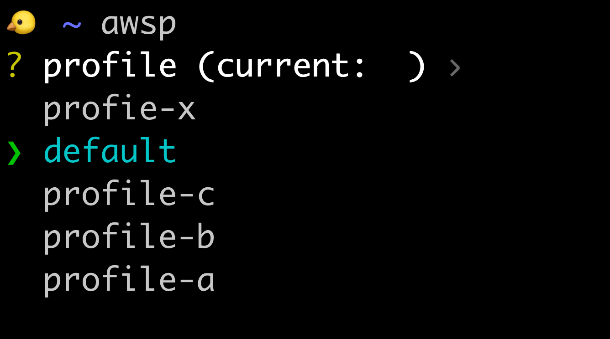
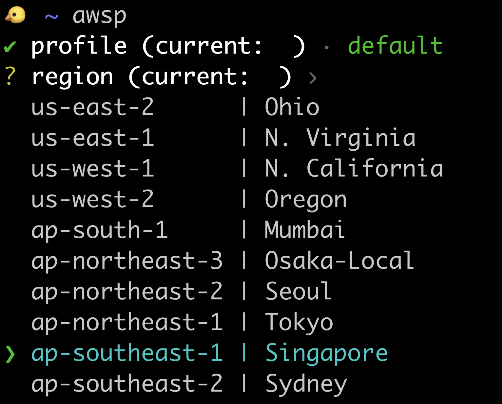

# AWSP - CLI To Manage your AWS Profiles!
AWSP provides an interactive terminal to interact with your AWS Profiles. The aim of this project is to make it easier to navigate, observe and manage your AWS Profiles in the wild. 

---

[](https://github.com/kubeopsskills/awsp/releases)
[](https://github.com/kubeopsskills/awsp/blob/beta/LICENSE-APACHE)
[](https://github.com/kubeopsskills/awsp/blob/beta/LICENSE-MIT)
[](https://github.com/kubeopsskills/awsp/releases)

---

## Demo



## Installation

AWSP is available on Linux, ARM, macOS and Windows platforms.
- Binaries for Linux, ARM, Windows and Mac are available as tarballs in the [release](https://github.com/kubeopsskills/awsp/releases) page
## Build it yourself

### Prerequisite
- rust: [rust](https://www.rust-lang.org/tools/install)
- upx: [upx](https://upx.github.io/)

### Getting Started
- Clone the repository to your local machine.
- `cd` to the root of project folder.

```bash
make all
```

### Link binary to $Path
```bash
ln -s /target/release/awsp ~/usr/local/bin/awsp
```
## Usage
```bash
USAGE:
    awsp [OPTIONS]

FLAGS:
    -h, --help    Prints help information

OPTIONS:
    -c, --config <config>      Override an aws configuration file (default = ~/.aws/config)
    -r, --region <region>      Region Selector
    -v, --version <version>    Print version info and exit
```

## Contributing

We'd love your help! Please see [CONTRIBUTING][contrib] to learn about the
kinds of contributions we're looking for.

## Todo
- We use [GitHub Issues][github-issue] to track our to do items.
- Please check the [following link][follow] if you would like to contribute to the project.

## CHANGELOG
See [CHANGELOG][changelog]

## Reporting issues and feedback
If you encounter any bugs with the tool please file an issue in the [Issues](https://github.com/kubeopsskills/awsp/issues) section of our GitHub repo.

[contrib]: https://github.com/kubeopsskills/awsp/blob/beta/CONTRIBUTING.md
[follow]: https://github.com/kubeopsskills/awsp/blob/beta/CONTRIBUTING.md
[changelog]: https://github.com/kubeopsskills/awsp/blob/beta/CHANGELOG.md
[github-issue]: https://github.com/kubeopsskills/awsp/issues/new